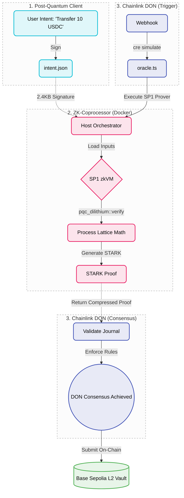

# Quantum-Safe CRE: Decentralized Post-Quantum Account Abstraction

## The Threat & The Trap
In the coming years, quantum computers running Shor's Algorithm will fundamentally break ECDSA, the elliptic curve cryptography that secures 99% of Web3 digital assets. 

The cryptographic standard to survive this is **ML-DSA (Dilithium)**—a post-quantum algorithm based on the extreme mathematical difficulty of finding the shortest vector in a multi-dimensional lattice. 

However, this creates the **EVM Gas Trap**: Dilithium signatures are massive (~2.4KB). If you attempt to verify lattice math natively on Ethereum, the computational overhead and calldata size will exceed block gas limits, making quantum-safe wallets economically impossible.

## The Solution: ZK Orchestration via Chainlink
This architecture bypasses the EVM bottleneck by decoupling the heavy cryptography from the settlement layer.

We utilize a **ZK-Coprocessor (SP1)** to grind the lattice math off-chain, proving the signature is valid, and compressing it into a highly efficient STARK proof. We then utilize the **Chainlink Decentralized Oracle Network (via the Runtime Environment)** to orchestrate this process, validate the inputs against malicious provers, and deliver the STARK proof to the Layer 2 smart contract.

The EVM verifies the STARK proof for flat, cheap gas, entirely ignorant of the massive quantum math that occurred off-chain.

### Architecture Flow

*Figure 1: The Quantum-Safe CRE Pipeline. Massive Post-Quantum lattice cryptography (ML-DSA) is decoupled from the EVM constraint. The Chainlink Decentralized Oracle Network dynamically orchestrates an isolated SP1 zkVM, mathematically proving the signature off-chain and compressing the computation into a cheap, gas-efficient STARK proof.*

### Microservices
1. **`1-client`**: A Rust client that generates a user intent and secures it with an ML-DSA lattice signature.
2. **`2-sp1-coprocessor`**: A Dockerized RISC-V Zero-Knowledge VM that ingests the intent, runs the lattice verification, and outputs a cryptographic STARK proof.
3. **`3-chainlink-cre`**: The local Chainlink node orchestrator (TypeScript) that triggers the prover, validates the STARK journal to prevent tampering, and achieves decentralized consensus.

## Execution
Run `cre simulate workflow.yaml` inside the `3-chainlink-cre` directory to initiate the end-to-end multi-network validation.
