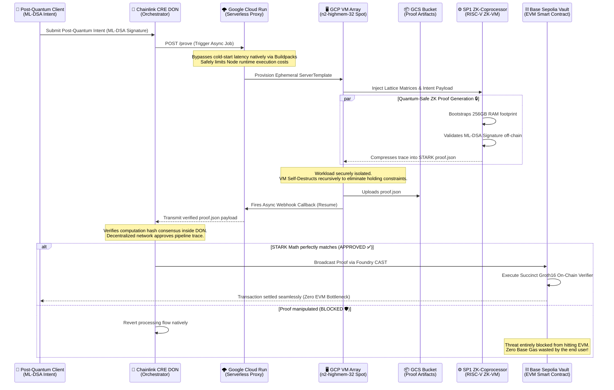

# Quantum-Safe CRE: Decentralized Post-Quantum Account Abstraction

## The Threat & The Trap
In the coming years, quantum computers running Shor's Algorithm will fundamentally break ECDSA, the elliptic curve cryptography that secures 99% of Web3 digital assets. 

The cryptographic standard to survive this is **ML-DSA (Dilithium)**—a post-quantum algorithm based on the extreme mathematical difficulty of finding the shortest vector in a multi-dimensional lattice. 

However, this creates the **EVM Gas Trap**: Dilithium signatures are massive (~2.4KB). If you attempt to verify lattice math natively on Ethereum, the computational overhead and calldata size will exceed block gas limits, making quantum-safe wallets economically impossible.

## The Solution: ZK Orchestration via Chainlink
This architecture bypasses the EVM bottleneck by decoupling the heavy cryptography from the settlement layer.

We utilize a **ZK-Coprocessor (SP1)** to grind the lattice math off-chain, proving the signature is valid, and compressing it into a highly efficient STARK proof. We then utilize the **Chainlink Decentralized Oracle Network (via the Runtime Environment)** to orchestrate this process, validate the inputs against malicious provers, and deliver the STARK proof to the Layer 2 smart contract.

SP1 generates a STARK trace and compresses it via a Groth16 SNARK wrapper for EVM verification. The blockchain validates this zero-knowledge artifact for flat, cheap gas, entirely ignorant of the massive quantum math that occurred off-chain.

### Institutional Telemetry & The EVM Compromise
**The Native Limitation:** Standard ML-DSA (Dilithium) matrices simply cannot exist efficiently on Ethereum. Processing the massive multidimensional polynomial rings securely requires over **30,000,000 Gas**, instantaneously exceeding the absolute block limit.

**The Solution Profile:** By routing the execution natively through the off-chain SP1 Coprocessor and locking it asynchronously into a Chainlink Decentralized Oracle Network, we drastically cut this requirement. 
- *Extracted Base Sepolia E2E Telemetry:* **343,111 Gas** (Verification & Settlement)
- *Total Cost Compression:* **98.8%**

**The Groth16 Transpilation Trap**: To achieve EVM composability on Base Sepolia today, this architecture utilizes a Groth16 wrapper over the SP1 STARK. Because Groth16 relies on the BN254 elliptic curve, the final on-chain settlement is theoretically vulnerable to Shor's algorithm. 

The End-State architecture targets STARK-native rollups (like StarkNet) to verify the pure hash-based STARK directly. This fully bypasses the SNARK curve dependencies, achieving 100% end-to-end quantum resistance.

### Architecture Flow



*Figure 1: The Quantum-Safe CRE Pipeline End-to-End Execution Flow. Massive Post-Quantum lattice cryptography (ML-DSA) is decoupled from Ethereum constraints. The Chainlink Decentralized Oracle Network hooks into a Google Cloud Run Serverless adapter, automatically spawning huge Spot datacenters to map the SP1 mathematical matrices, dropping the computed payload natively into Cloud storage, and orchestrating the completion back into the decentralized Base Sepolia EVM broadcast layer seamlessly.*

### Microservices
1. **`1-client`**: A Rust client that generates a user intent and secures it with an ML-DSA lattice signature.
2. **`2-sp1-coprocessor`**: A Dockerized RISC-V Zero-Knowledge VM that ingests the intent, runs the lattice verification, and outputs a cryptographic STARK proof.
3. **`3-chainlink-cre`**: The Chainlink External Adapter orchestrator (TypeScript). 
   - **Serverless Cloud Run Migration (Phase 3)**: The native server endpoint is deployed serverlessly via Google Cloud Run endpoints. It utilizes native TypeScript "baking" (Pre-compiled to ECMA modules) directly through Google Buildpacks to drastically minimize Node.js cold-start latencies. This boundary safely traps Chainlink's asynchronous HTTP hooks and instantly maps orchestration bounds natively to the Ephemeral GCP Spot Arrays at zero continuous holding cost.
4. **`4-base-sepolia-vault`**: The L2 Settlement Layer. A Solidity smart contract deployed on Base Sepolia. It acts as the final settlement vault, utilizing Succinct's on-chain verifier to cheaply validate the STARK proof orchestrated by Chainlink, finalizing the post-quantum transaction on Ethereum.
   - **Vault Address (V2 w/ Replay Protection):** [`0x42f60ABfeB12EF53DB0c05983D5Da76386dE2fF8`](https://base-sepolia.blockscout.com/address/0x42f60abfeb12ef53db0c05983d5da76386de2ff8)

## Execution & Understanding the Flow

This architecture decouples heavy computation from standard orchestration. The two critical cryptographic artifacts enabling this are preserved into this repository:
- `intent.json`: The signed post-quantum intent (ML-DSA lattice signature) generated by the Local Client.
- `proof.json`: The raw SNARK/STARK payload containing the exact mathematical consensus output from the SP1 Coprocessor.

Because executing the SP1 prover natively demands immense RAM and CPU overhead, the authentic `proof.json` is checked into the repo. This enables anyone to instantly run and audit the end-to-end Chainlink orchestration and on-chain settlement without deploying servers or mocking execution.

**Regenerating Cryptography via Google Cloud Engine:**
If you wish to natively recalculate the ZK proofs yourself, this repository features advanced automation scripts combining SP1 capability with ephemeral datacenter orchestration:
- **`deploy_cloud_prover.ps1`**: Securely provisions a massive ephemeral Google Cloud Spot Instance (`n2-highmem-32` spanning 32 CPU Cores and 256GB RAM) required to house the polynomial matrices.
- **`gcp_execute.sh`**: Pushed dynamically into the cloud environment, this script configures the Dockerized Rust toolchain, grinds the STARK trace off-chain, and seamlessly isolates the new `proof.json` back to your laptop.

To immediately trigger the Chainlink DON and natively broadcast the `proof.json` into the Base Sepolia Layer 2 Vault via Foundry, utilize the flagship execution pipeline:

**Linux / macOS:**
```bash
./flagship_demo.sh
```

**Windows:**
```powershell
.\flagship_demo.ps1
```
