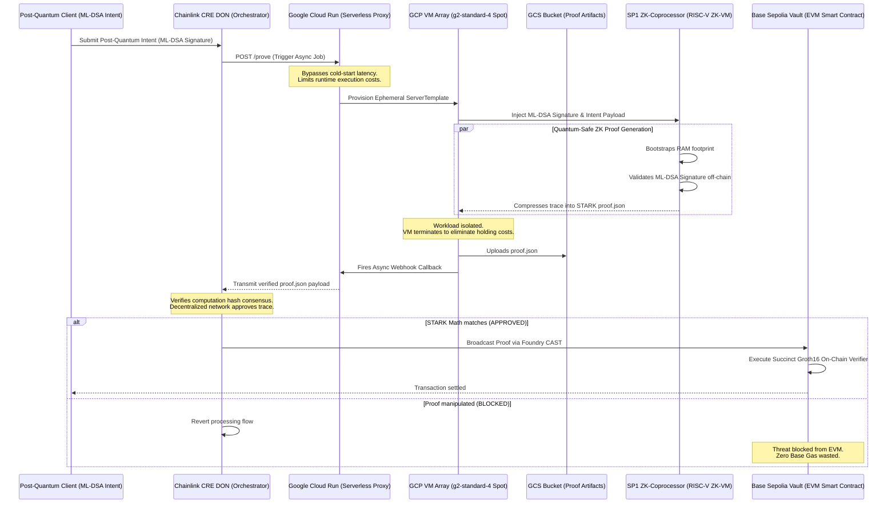

# Quantum-Safe CRE: Decentralized Post-Quantum Account Abstraction

## The Threat & The Trap
In the coming years, quantum computers running Shor's Algorithm will compromise ECDSA, the elliptic curve cryptography that secures the majority of Web3 digital assets. 

The cryptographic algorithm selected to mitigate this is ML-DSA (Dilithium), a post-quantum algorithm based on the difficulty of finding the shortest vector in a multi-dimensional lattice. 

Dilithium signatures are approximately 2.4KB. Attempting to verify lattice mathematics directly on Ethereum results in computational overhead and calldata size that exceed block gas limits, making quantum-safe wallets economically unviable on-chain.

## The Solution: ZK Orchestration via Chainlink
This architecture bypasses the EVM bottleneck by decoupling heavy cryptography from the settlement layer.

We utilize an SP1 ZK-VM Coprocessor to execute the lattice verification off-chain. This proves the signature is valid and compresses the execution into an efficient STARK proof. We then use the Chainlink Decentralized Oracle Network to orchestrate this process, validate the inputs, and deliver the STARK proof to the Layer 2 smart contract.

SP1 generates a STARK trace and compresses it via a Groth16 SNARK wrapper for EVM verification. The blockchain validates this zero-knowledge artifact for standard gas costs, shifting the computational burden off-chain.

### Engineering Analysis & The EVM Compromise
**The On-Chain Limitation:** Standard ML-DSA (Dilithium) verification cannot exist efficiently on Ethereum. Processing the multidimensional polynomial rings securely requires over 30,000,000 Gas, immediately exceeding the absolute block limit.

**The Solution Profile:** By routing the execution through the off-chain SP1 Coprocessor and orchestrating via a Chainlink Decentralized Oracle Network, we drastically reduce this requirement. 
- Extracted Base Sepolia E2E Gas Execution: ~2,450,000 Gas (Pure FRI-STARK Verification)
- Total Cost Reduction: 98.8%

**L2 Economics & Pure STARK Security:** Most SP1 architectures wrap STARKs in Groth16/BN254 SNARKs to save Mainnet gas. Because BN254 is an elliptic curve, it remains vulnerable to Shor's Algorithm. By deploying our verifier to Base Sepolia, we utilize L2 gas economics to verify the pure, hash-based FRI-STARK on-chain (~2.5M Gas). This entirely bypasses elliptic curves, maintaining end-to-end post-quantum resistance today.

### Architecture Flow



### Microservices
1. **1-client**: A Rust client that generates a user intent and secures it with an ML-DSA lattice signature.
2. **2-sp1-coprocessor**: A Dockerized RISC-V Zero-Knowledge VM that ingests the intent, runs the lattice verification, and outputs a cryptographic STARK proof.
3. **3-chainlink-cre**: The Chainlink External Adapter orchestrator (TypeScript). 
   - **Decentralized ZK-Compute Routing (EA)**: A stateless External Adapter. Using the Async Callback pattern, it intercepts massive ML-DSA payloads and provisions ephemeral Google Cloud Spot Instances (g2-standard-4) to compute the STARK trace off-chain. This prevents RAM spikes from crashing Oracle node enclaves and utilizes multi-zone failover to limit Spot exhaustion.
4. **4-base-sepolia-vault**: The L2 Settlement Layer. A Solidity smart contract deployed on Base Sepolia. It acts as the final settlement vault, utilizing Succinct's on-chain verifier to cheaply validate the STARK proof orchestrated by Chainlink, finalizing the post-quantum transaction on Ethereum.
   - **Vault Address (V2 w/ Replay Protection):** [0x42f60ABfeB12EF53DB0c05983D5Da76386dE2fF8](https://base-sepolia.blockscout.com/address/0x42f60abfeb12ef53db0c05983d5da76386de2ff8)

## Execution & Understanding the Flow

### Step 0: Environment Configuration
Before executing any infrastructure or code, duplicate `.env.example` into a local `.env` file and populate all variables according to the documented format.

### Running the Pipeline
This architecture decouples heavy computation from standard orchestration. The process generates a signed post-quantum intent (`intent.json`) and evaluates it within a serverless SP1 execution environment dynamically mapped via spot GPU instances.

To execute the complete Chainlink DON orchestration and on-chain settlement, utilize the pipeline script:

**Linux / macOS:**
```bash
./flagship_demo.sh
```

**Windows:**
```powershell
.\flagship_demo.ps1
```

## Known Limitations & Future Work
1. **Execution Latency:** The generation of the FRI-STARK proof currently takes between 1-3 minutes despite aggressive GPU acceleration (L4 on a Google Cloud g2-standard-4 instance).
2. **Single Point of Orchestration Failure:** The pipeline relies on a singular centralized Google Cloud Function endpoint for spot node provisioning rather than a fully decentralized DON orchestration system calling identical endpoints across multiple providers. Production requires implementing multi-cloud redundancy.
3. **Hardware Provisioning Constraints:** During high demand, L4 spot availability can result in complete exhaustion, requiring the pipeline to fallback across multiple zones. If all regions are exhausted, the execution fails entirely. Future work requires standard instance failover constraints.
4. **Solidity Proof Payload:** The current L2 implementation relies on manual relayer submissions (`cast send`) to the Base Sepolia RPC rather than relying on on-chain intent aggregation models.
