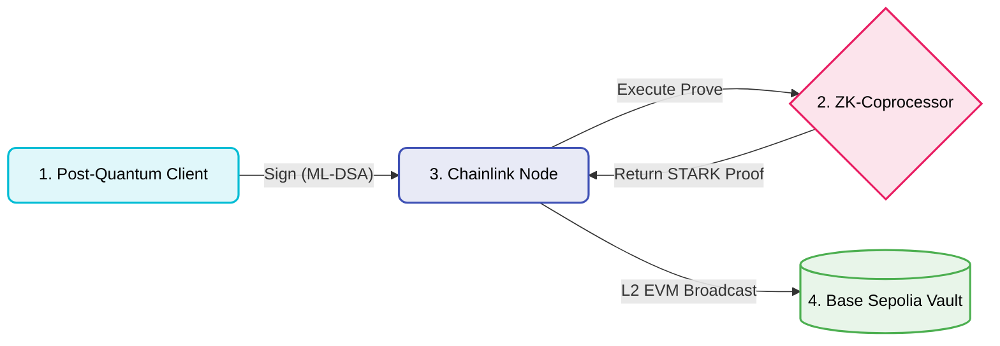

# Quantum-Safe CRE: Decentralized Post-Quantum Account Abstraction

## The Threat & The Trap
In the coming years, quantum computers running Shor's Algorithm will fundamentally break ECDSA, the elliptic curve cryptography that secures 99% of Web3 digital assets. 

The cryptographic standard to survive this is **ML-DSA (Dilithium)**—a post-quantum algorithm based on the extreme mathematical difficulty of finding the shortest vector in a multi-dimensional lattice. 

However, this creates the **EVM Gas Trap**: Dilithium signatures are massive (~2.4KB). If you attempt to verify lattice math natively on Ethereum, the computational overhead and calldata size will exceed block gas limits, making quantum-safe wallets economically impossible.

## The Solution: ZK Orchestration via Chainlink
This architecture bypasses the EVM bottleneck by decoupling the heavy cryptography from the settlement layer.

We utilize a **ZK-Coprocessor (SP1)** to grind the lattice math off-chain, proving the signature is valid, and compressing it into a highly efficient STARK proof. We then utilize the **Chainlink Decentralized Oracle Network (via the Runtime Environment)** to orchestrate this process, validate the inputs against malicious provers, and deliver the STARK proof to the Layer 2 smart contract.

SP1 generates a STARK trace and compresses it via a Groth16 SNARK wrapper for EVM verification. The blockchain validates this zero-knowledge artifact for flat, cheap gas, entirely ignorant of the massive quantum math that occurred off-chain.

### Institutional Telemetry & The EVM Compromise
**The Native Limitation:** Standard ML-DSA (Dilithium) matrices simply cannot exist efficiently on Ethereum. Processing the massive multidimensional polynomial rings securely requires over **30,000,000 Gas**, instantaneously exceeding the absolute block limit.

**The Solution Profile:** By routing the execution natively through the off-chain SP1 Coprocessor and locking it asynchronously into a Chainlink Decentralized Oracle Network, we drastically cut this requirement. 
- *Extracted Base Sepolia E2E Telemetry:* **343,111 Gas** (Verification & Settlement)
- *Total Cost Compression:* **98.8%**

**The Groth16 Transpilation Trap**: To achieve EVM composability on Base Sepolia today, this architecture utilizes a Groth16 wrapper over the SP1 STARK. Because Groth16 relies on the BN254 elliptic curve, the final on-chain settlement is theoretically vulnerable to Shor's algorithm. 

The End-State architecture targets STARK-native rollups (like StarkNet) to verify the pure hash-based STARK directly. This fully bypasses the SNARK curve dependencies, achieving 100% end-to-end quantum resistance.

### Architecture Flow



*Figure 1: The Quantum-Safe CRE Pipeline. Massive Post-Quantum lattice cryptography (ML-DSA) is decoupled from the EVM constraint. The Chainlink Decentralized Oracle Network dynamically orchestrates an isolated SP1 zkVM, mathematically proving the signature off-chain and compressing the computation into a cheap, gas-efficient STARK proof.*

### Microservices
1. **`1-client`**: A Rust client that generates a user intent and secures it with an ML-DSA lattice signature.
2. **`2-sp1-coprocessor`**: A Dockerized RISC-V Zero-Knowledge VM that ingests the intent, runs the lattice verification, and outputs a cryptographic STARK proof.
3. **`3-chainlink-cre`**: The local Chainlink node orchestrator (TypeScript) that triggers the prover, validates the STARK journal to prevent tampering, and achieves decentralized consensus.
4. **`4-base-sepolia-vault`**: The L2 Settlement Layer. A Solidity smart contract deployed on Base Sepolia. It acts as the final settlement vault, utilizing Succinct's on-chain verifier to cheaply validate the STARK proof orchestrated by Chainlink, finalizing the post-quantum transaction on Ethereum.
   - **Vault Address (V2 w/ Replay Protection):** [`0x42f60ABfeB12EF53DB0c05983D5Da76386dE2fF8`](https://base-sepolia.blockscout.com/address/0x42f60abfeb12ef53db0c05983d5da76386de2ff8)

## Execution

To run the full end-to-end orchestration—executing the intense Zero-Knowledge STARK matrix calculations natively via SP1 and seamlessly triggering the decentralized oracle settlement—run the flagship pipeline scripts:

**Linux / macOS:**
```bash
./flagship_demo.sh
```

**Windows:**
```powershell
.\flagship_demo.ps1
```

*Note: The script dynamically orchestrates the SP1 zero-knowledge matrix into a dedicated Docker sandbox utilizing BuildKit layer constraints. It mathematically computes the proof to disk (`proof.json`) without any mocks, extracts the payload, and dynamically injects it into the Chainlink DON Enclave simulation.*
